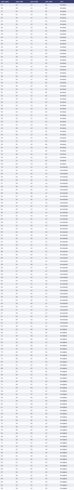

# pands-project

## Contents
[Description](#Description)

[Problem Statement](#Problem-Statement)

[Definitions](#Definitions)

[Background](#Background)

[analysis.py](analysis.py)

[Discussion](#Discussion)

[Conclusion](#Conclusion)

[References](#References)

[Appendix 1](#Appendix-1)

## Description

This repository contains the files for the submission of the module assignment in the Programming and Scripting module
for the ATU Mayo & Galway Higher Diploma in Computer Programming and Data Analytics.

### Problem Statement
This project concerns the well-known [Fisher’s Iris data set](#Background).

Imagine that your manager has asked you to investigate the data set, with a
view to explaining it to your colleagues. Imagine that you are to give a presentation on the
data set in a few weeks’ time, where you explain what investigating a data set entails and how
Python can be used to do it. 

---
## Definitions

+ [Multivariate Statistics](https://en.wikipedia.org/wiki/Iris_flower_data_set) - is a branch of statistics that is 
used when two or more variables have to be analysed simultaneously. Types of Multivariate Analysis include 
Cluster Analysis, Factor Analysis, Multiple Regression Analysis, Principal Component Analysis, etc. There is more than
20 ways to perform multivariate analysis.
+ [Sepal](https://en.wikipedia.org/wiki/Sepal) - in plants that flower the sepal is the part of the flower that 
functions as protection for the flower in bud and often as support for the petals when the flower is in bloom.
---
## Background

The [Iris Data Set](https://en.wikipedia.org/wiki/Iris_flower_data_set) is a data set that consists 50 samples from 
three species of Iris - Iris setosa, Iris virginica and Iris versicolor. Each sample contains 4 measurements:
1. Petal width
2. Petal length
3. Sepal width
4. Sepal length

This data set is an example of a multivariate data set and was popularised by statistician and biologist [Sir Ronald
Fisher](https://en.wikipedia.org/wiki/Ronald_Fisher) in his 1936 paper entitled 
[*"The use of multiple measurements in taxonomic problems"*](https://digital.library.adelaide.edu.au/dspace/bitstream/2440/15227/1/138.pdf)
. The data was collected by [Dr. Edgar Anderson](https://en.wikipedia.org/wiki/Edgar_Anderson) from the Gaspé Peninsula
in Canada. Two of the three species were collected from the same meadow, by the same person, using standard equipment 
in order to minimise the risk of variation in the data samples arising from the way in which it was collected and 
measured. Dr. Anderson is recognised as a significant contributor in the field of botanical genetics.

As can be seen from the picture below the appearance of each species is similar. Sir Fisher's Analysis of the data set
enabled accurate classification of the species from petal and sepal measurement and as a result the data set is 
routinely used as a beginners dataset for machine learning purposes.

---

## analysis.py

## Discussion
Please see [Appendix 1](#appendix-1) for a summary of the Iris Data set in table format.

## Conclusion

## References

### Code Sources

1. https://www.delftstack.com/howto/python-pandas/pandas-png/ - accessed 30/03/2023
2. https://gist.github.com/curran/a08a1080b88344b0c8a7#file-iris-csv - accessed 30/03/2023

### Background Information
1. https://digital.library.adelaide.edu.au/dspace/bitstream/2440/15227/1/138.pdf - accessed 27/03/2023
2. https://en.wikipedia.org/wiki/Edgar_Anderson - accessed 27/03/2023
3. https://en.wikipedia.org/wiki/Iris_flower_data_set - accessed 27/03/2023
4. https://en.wikipedia.org/wiki/Ronald_Fisher - accessed 27/03/2023
5. https://en.wikipedia.org/wiki/Sepal accessed 27/03/2023
6. https://www.kaggle.com/code/amrut11/iris-dataset-univariate-bivariate-multivariate access27/03/2023
---

## Appendix 1

**Table 1 - Iris Data Set Summary** 

