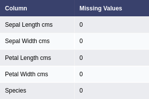
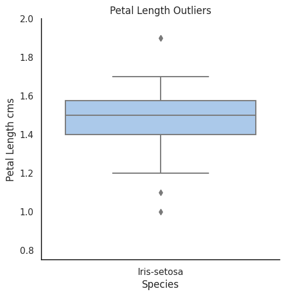
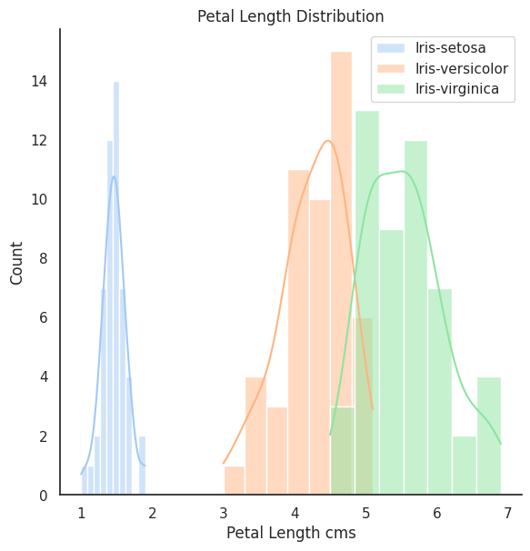
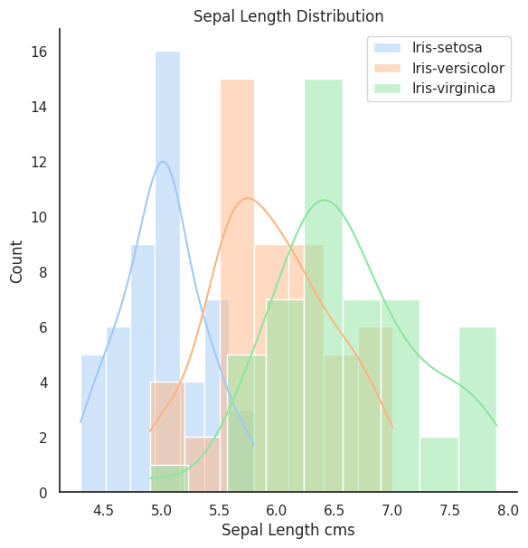
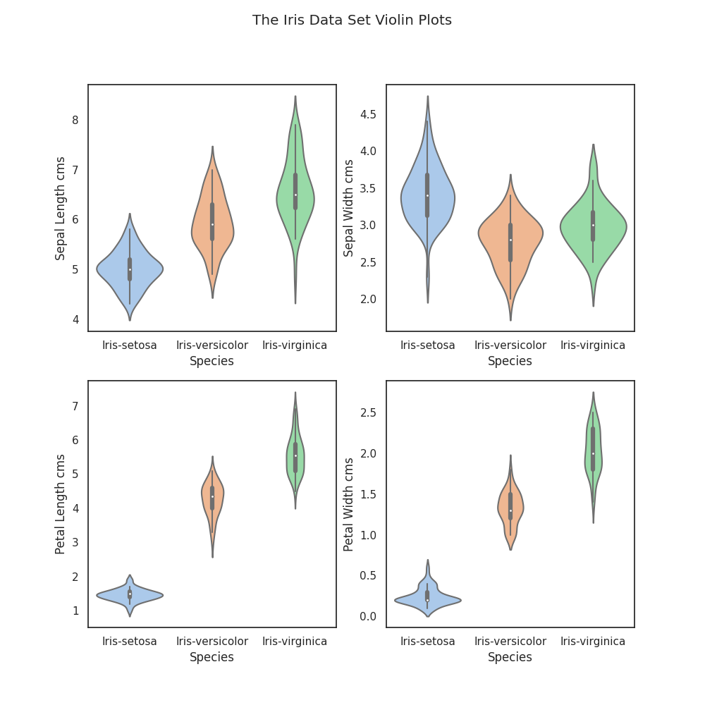
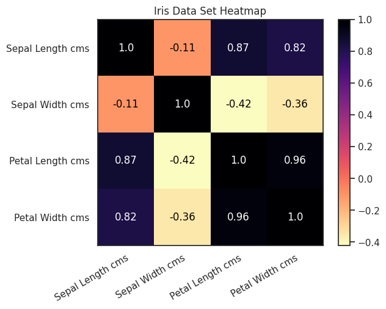
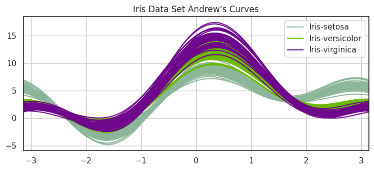
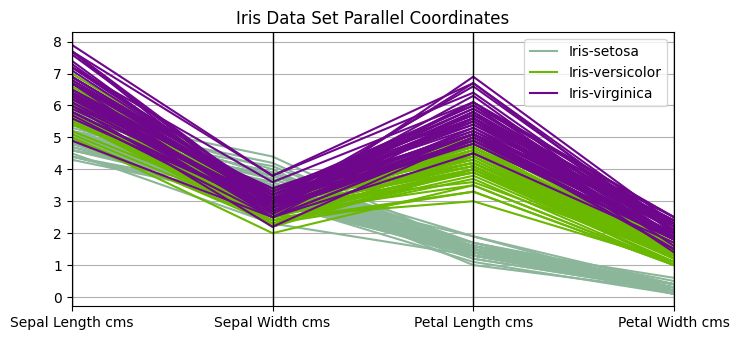
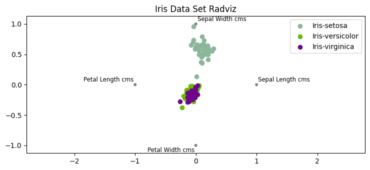
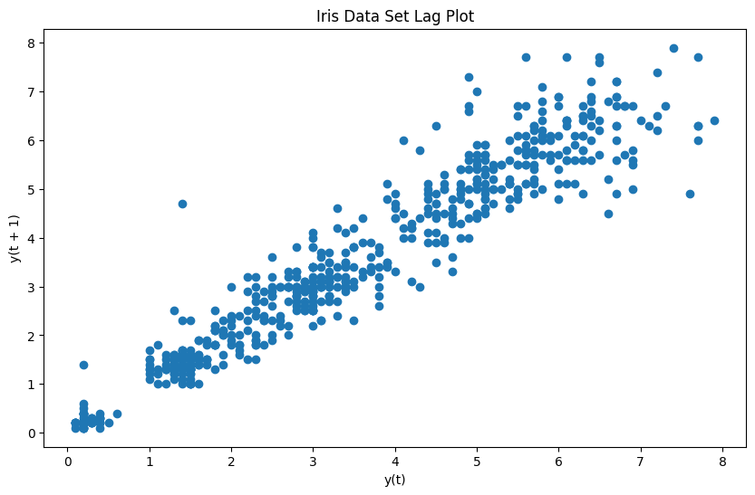

# pands-project

## Contents
[Description](#Description)

[Problem Statement](#Problem-Statement)

[Definitions](#Definitions)

[Background](#Background)

[analysis.py](#analysispy)

[Discussion](#Discussion)

[Conclusion](#Conclusion)

[References](#References)

[Appendix 1](#Appendix-1)

## Description

This repository contains the files for the submission of the module assignment in the Programming and Scripting module
for the ATU Mayo & Galway Higher Diploma in Computer Programming and Data Analytics.

To run the script from the command line type - *python analysis.py*

### Problem Statement
This project concerns the well-known [Fisher’s Iris data set](#Background).

Imagine that your manager has asked you to investigate the data set, with a
view to explaining it to your colleagues. Imagine that you are to give a presentation on the
data set in a few weeks’ time, where you explain what investigating a data set entails and how
Python can be used to do it. 

---
## Definitions

+ Andrew's Curves (https://en.wikipedia.org/wiki/Andrews_plot) - are a way to visualize structure in high-dimensional
data
+ Bivariate analysis (https://www.questionpro.com/blog/bivariate-analysis/) - is a statistical method for examining how
two different things are related
+ Boxplot (https://en.wikipedia.org/wiki/Box_plot) - is a method for graphically demonstrating the spread of numerical 
data through their quantities 
+ Histogram (https://en.wikipedia.org/wiki/Histogram) - is a representation of the approximated distribution of 
numerical data.
+ Kernel Density Estimation, KDE (https://en.wikipedia.org/wiki/Kernel_density_estimation) - is the application of 
kernel smoothing for probability density estimation 
+ Lag plot (https://www.itl.nist.gov/div898/handbook/eda/section3/lagplot.htm) - checks whether a data set is random or 
not
+ Multivariate Statistics (https://s4be.cochrane.org/blog/2021/09/09/multivariate-analysis-an-overview/) - is a branch 
of statistics that is used when two or more variables have to be analysed simultaneously. Types of Multivariate Analysis 
include Cluster Analysis, Factor Analysis, Multiple Regression Analysis, Principal Component Analysis, etc. There is 
more than 20 ways to perform multivariate analysis.
+ Paralell Coordinates (https://en.wikipedia.org/wiki/Parallel_coordinates) - are a common way of visualizing and 
analyzing high-dimensional datasets. 
+ RadViz (https://pandas.pydata.org/pandas-docs/stable/user_guide/visualization.html#radviz) -  is a way of visualizing 
multivariate data based on a simple spring tension minimization algorithm.
+ Sepal (https://en.wikipedia.org/wiki/Sepal) - in plants that flower the sepal is the part of the flower that 
functions as protection for the flower in bud and often as support for the petals when the flower is in bloom.
+ Violin Plot (https://en.wikipedia.org/wiki/Violin_plot) - a statistical graphic for comparing 
probability distributions

---
## Background

The [Iris Data Set](https://en.wikipedia.org/wiki/Iris_flower_data_set) is a data set that consists 50 samples from 
three species of Iris - Iris-setosa, Iris-virginica and Iris-versicolor. Each sample contains 4 measurements:
1. Petal width
2. Petal length
3. Sepal width
4. Sepal length

This data set is an example of a multivariate data set and was popularised by statistician and biologist [Sir Ronald
Fisher](https://en.wikipedia.org/wiki/Ronald_Fisher) in his 1936 paper entitled 
[*"The use of multiple measurements in taxonomic problems"*](https://digital.library.adelaide.edu.au/dspace/bitstream/2440/15227/1/138.pdf)
. The data was collected by [Dr. Edgar Anderson](https://en.wikipedia.org/wiki/Edgar_Anderson) from the Gaspé Peninsula
in Canada. Two of the three species were collected from the same meadow, by the same person, using standard equipment 
in order to minimise the risk of variation in the data samples arising from the way in which it was collected and 
measured. Dr. Anderson is recognised as a significant contributor in the field of botanical genetics.

As can be seen from the picture below the appearance of each species is similar. Sir Fisher's Analysis of the data set
enabled accurate classification of the species from petal and sepal measurement and as a result the data set is 
routinely used as a beginners dataset for machine learning purposes.

---

## [analysis.py](analysis.py)

The script is run from the command line with the command *python analysis.py*.

A series of updates are outputted as the script executes. The purpose of this is to indicate to the user that the script
is executing.

The script generates a number of tables and graphs, listed [here](#output-files), that are used to analyse the data 
set. 

### The Python script:
+ Reads in the Iris Data Set CSV from a URL
+ Creates a folder to save the output of the script in the user's home directory. This works independently of operating 
system
+ Checks for missing values in the data and outputs the results to a summary table
+ Outputs the Iris Data Set variables to a text file
+ Creates a summary of the data in the tabular form
+ Outputs the full data set in tabular form
+ Creates histograms used to analyse the data set
+ Creates and outputs box plots of the data set
+ Demonstrates an example of removing the outliers and re-plotting a box plot
+ Creates and outputs violin plots to demonstrate density of the distribution of data within the data set
+ Generates and saves a heatmap of the data set
+ Generates and saves pairplots of the data set for bivariate analysis
+ Creates and saves a set of Andrew's Curves used in multivariate analaysis of the data set 
+ Generates and saves parallel coordinates plots used in multivariate analysis of the data set
+ Outputs a radviz plot of the Iris sata set
+ Creates and saves a lag plot of the data set

### Libraries used:
+ pandas as pd - pandas module used to read in the data set file as a data frame 
+ pandas.plotting - required to produce Andrew's Curves plot, parallel_coordinates plot, radviz plot & lag plot 
+ plotly.figure_factory - module used to create a table of the data for display in the README.md file 
+ seaborn - the seaborn module used for plotting data representation - more advanced functionality that matplotlib 
+ matplotlib.pyplot - the matplotlib module used to plot data for visual representation 
+ import csv - used for csv file reading and writing 
+ numpy - library used for working with arrays
+ os - this module provides a portable way of using operating system dependent functionality 
+ earthpy - specific function in this library used to the home directory 
+ datetime - used to save files with current date & time stamp in filename

### Output files:
+ [data_summary.txt](images/tables/data_summary.png "Data Summary") - a text file containing a summary of the Iris Day 
set generated by analysis.py
+ [iris_data_set_full.png](images/tables/iris_data_set_full.png "Full Iris Data Set") - a png file with a tabular summary 
of the iris data set - see [Appendix 1](#appendix-1)
+ [missing_values.png](images/tables/missing_values.png "Iris Data Set Missing Values Summary") - a png file analysing 
the data set for missing values
+ [data_summary.png](images/tables/data_summary.png "Iris Data Set Summary") - a png file summarising the Irish Data Set
+ [petal_length_histogram.png](images/plots/histograms/petal_length_histogram.png "Petal Length Histogram") - 
png file of a histogram for petal length
+ [petal_width_histogram.png](images/plots/histograms/petal_width_histogram.png "Petal Width Histogram") - png file of
a histogram for petal width
+ [sepal_length_histogram.png](images/plots/histograms/sepal_length_histogram.png "Sepal Length Histogram") - png 
file of a histogram for sepal length
+ [sepal_width_histogram.png](images/plots/histograms/sepal_width_histogram.png "Sepal Width Histogram") - png file of
a histogram for sepal width
+ [box_plots.png](images/plots/box_plots/box_plots.png "Iris Data Set Boxplots") - a png file dislaying box plots of the
Iris Data set
+ [outliers_box_plots.png](images/plots/box_plots/outliers_box_plots.png "Iris Data Set Outliers") - a box plot of 
outliers in the petal length subset of data for the Iris-setosa species.
+ [no_outliers_box_plots.png](images/plots/box_plots/no_outliers_box_plots.png "Iris Data Set Outlier Cleansing") - a 
box plot of the petal length subset of data for the Iris_setosa species cleansed of outliers
+ [violin_plots.png](images/plots/violin_plots/violin_plots.png "Iris Data Set Violin Plots") - violin plots of the Iris
Data Set
+ [heatmap.png](images/plots/heatmap/heatmap.png "Iris Data Set Heatmap") - heatmap of the Iris Data set
+ [pairplots.png](images/plots/pairplots/pairplot.png "Iris Data Set Bivariate Analysis") - pairplots of the Iris Data
set
+ [andrews_curves](images/plots/multivariate/andrews_curves.png "Andrew's Curves") - Andrew's curves plots of the Iris
Data Set
+ [parallel_coordinates.png](images/plots/multivariate/parallel_coordinates.png "Iris Data Set Parallel Coordinates") -
Parallel Coordinates plots of the Iris Data Set
+ [radviz.png](images/plots/multivariate/radviz.png "Radviz Plot") - Radviz plot of the Iris Data set
+ [lag_plots.png](images/plots/multivariate/lag_plot.png "Iris Data Set Lag Plot") - Lag plot of the Iris Data set.

---
## Discussion
Python is an extremely powerful tool for automating the handling of large datasets. Using Python scripting the Iris 
Dataset was automatically read in as a dataframe, by a module within Python, from an online data repository. The 
Pandas module was used to achieve this. Pandas is a library that can be imported into Python allowing for data 
analysis through the use of specifically designed tools that automate complex functions on data sets. 

All the tables summarising data set were produced using the Plotly & Kaleido modules within python. These tools 
automate the creation of formatted tables. For the full tabulated Iris Data set please see [Appendix 1](#appendix-1).

### Data Quality

The quality of the source data was checked using a number of python methods imported from the Pandas module.
The "isnull" method within Pandas allows the source data set to be checked for any missing values. 
[Table 1](images/tables/missing_values.png) demonstrates the completeness of the data set and the absense of any missing 
values.

**Table 1 - Missing Values**

The Pandas "describe" method crates a summary of the min, max, mean, std, etc. as demonstrated in 
[Table 2](images/tables/data_summary.png) . This allows for a summary of the distribution of the data within the 
data set. This method can also be used to validate the count of the number of rows in the data set. As can be seen 
from the table this equals 150, as expected. 

**Table 2 - Data Summary** 

Boxplots were used to identify the presence of outliers in the data set. Outliers are described as objects that 
deviate significantly from the rest for the objects. 
[Outliers](https://medium.com/analytics-vidhya/its-all-about-outliers-cbe172aa1309) can be caused by a number of things 
including measurement error, sampling problems and natural variation. The outliers are visible on 
[Plot 1](images/plots/box_plots/box_plots.png) as diamonds. Plot 1 demonstrates that the number of outliers is minimal.
The outliers can also be visualised on the [lag plot](#lag-plot) as data points that are lying outside the overall 
pattern of the data demonstrated on the plot.

**Plot 1 - Iris Dataset Boxplots**

Applying the [interquartile method](https://www.geeksforgeeks.org/detect-and-remove-the-outliers-using-python/) 
it is possible to remove outliers from the data set using python. The challenge with the Iris data set is it's small
size and relatively small number of outliers. For demonstrative purposes one could look at cleansing the Iris-setosa 
petal length outliers. [Plot 2](images/plots/box_plots/outliers_box_plots.png) demonstrates the outliers for this 
subset of the data set. [Plot 3](images/plots/box_plots/no_outliers_box_plots.png) demonstrates the boxplot for the 
subset that has been cleansed of outliers using the interquartile method. Plot 3 appears to indicate that 
further outliers remain. The small data set size is causing this anomaly. Four outlier data points are removed when 
applying the interquartile method for this subset of the original data set. Given the anomaly caused by removing 
outliers, cleansing data of outliers only adds value with larger datasets. 

**Plot 2 - Outlier Demonstration**

**Plot 3 - Outlier Cleansed Subset**

### Univariate Analysis
The Seaborn library was used to create [histograms](#definitions). [Seaborn](https://seaborn.pydata.org/index.html) is 
a Python data visualization library based on matplotlib. It allows for drawing attractive and informative statistical
graphics.

**Plot 4 - Petal Length Distribution Histogram**

[Plot 4](images/plots/histograms/petal_length_histogram.png) demonstrates that Iris-setosa has the smallest petal length 
falling roughly between 1-2cms. There is some overlap in Petal Length between Iris-versicolor and Iris-virginica. 

**Plot 5 - Petal Width Distribution Histogram**

[Plot 5](images/plots/histograms/petal_width_histogram.png) demonstrates that Iris-setosa has the smallest petal width. 
There is some overlap in the petal width upper values of Iris-versicolor and the lower values of Iris-virginica. 

**Plot 6 - Sepal Length Distribution Histogram**

[Plot 6](images/plots/histograms/sepal_length_histogram.png) & [plot 7](images/plots/histograms/sepal_width_histogram.png) 
demonstrate that there is overlap in the range of values for sepal length & sepal width for all species 
measured. Based on this observation sepal width and sepal length are less accurate identifiers of species than petal 
length and width.

**Plot 7 - Sepal Width Distribution Histogram**

Violin plots (see plot 8) are similar to boxplots. In simple terms, denser regions of data are fatter while less dense 
regions are thinner. The output of this analysis supports the view that there is clear separation in petal length and 
petal width for Iris-setosa, making these variables good identifiers of the Iris-setosa species. It also confirms that 
there is overlap between sepal length and sepal width making them less ideal candidate for blind classification of the 
species.

**Plot 8 - Iris Dataset Violin PLots**

### Heatmaps
Heatmaps are used to identify correlations between variables. Values that are closer to 1 or -1 indicate correlation 
between variables. Colours with values of 1 are represented by dark colours and smaller values are represented by
lighter colours. 

**Plot 9 - Iris Data Set Heatmap**

The heatmap demonstrates a high level of correlation between petal width and petal length (having a value close to 1) and
a low correlation between sepal width and sepal length. The heatmap also demonstrates a relationship between petal 
length and sepal width and separately between petal width and sepal length.

### Bivariate Analysis

Using Pairplots from the Seaborn module the bivariate relationship between each pair of features can be demonstrated. 
The diagonal elements in the pairplot shows the Kernel Density Estimation (KDE). 

**Plot 10 - Iris Data Set Pairplots**

[Plot 10](images/plots/pairplots/pairplot.png) highlights that the Iris-setosa species is separated from the other two 
species across all the feature combinations supporting the observations made from the histogram plots.

### Multivariate Analysis
The pandas.plotting module is capable of producing multivariate analysis. This module was used to produce all of the 
plots in this section.

#### Andrew's Curves

**Plot 11 - Andrew's Curves**

Every curve on the plot represents a data point from the original dataset. The plot demonstrates that the curves from 
Iris-setosa are separate from the other two species of Iris. There is considerable overlap between the other two sets 
of curves. This is consistent with views of the data from the previous analysis

#### Parallel Coordinates
Each feature is plotted on a separate column. Lines are then drawn to connect the features for each data sample.

The above plot illustrates that Iris-setosa has a small petal length and petal width. It also indicates that 
Iris-veriscolor and Iris-virginica have flowers with similar sized sepal widths and lengths. There is a small degree of 
overlap in petal lengths for Iris-veriscolor and Iris-virginica suggesting that this variable would be best suited for 
blind classification of these species.

#### Radviz

The Radviz plot illustrates the data on a 2D plane, in this case a circle. The plot can be interpreted that 
Iris-virginica are more random because they are closer to the centre of the circle whereas Iris-setosa are more biased 
towards the sepal-width of the these flowers.

#### Lag Plot

The lag plot will check if a data set is random or not. Random data should not display any identifiable structure in the 
plot.

The above lag plot for the Iris Data set is displaying a linear pattern. The presence of outliers is observed on the 
plot.

## Conclusion

## References

### Code Sources

1. https://www.earthdatascience.org/courses/intro-to-earth-data-science/python-code-fundamentals/work-with-files-directories-paths-in-python/set-working-directory-os-package/ -
accessed 23/04/2023
2. https://gist.github.com/curran/a08a1080b88344b0c8a7#file-iris-csv - accessed 30/03/2023
3. https://gist.github.com/mwaskom/de44147ed2974457ad6372750bbe5751 - accessed 30/03/2023
4. https://matplotlib.org/stable/api/figure_api.html - accessed 20/04/2023
5. https://medium.com/analytics-vidhya/exploratory-data-analysis-uni-variate-analysis-of-iris-data-set-690c87a5cd40 - 
accessed 22/04/2023
6. https://seaborn.pydata.org/generated/seaborn.set_theme.html - accessed 20/04/2023
7. https://stackoverflow.com/questions/10607688/how-to-create-a-file-name-with-the-current-date-time-in-python - 
accessed 23/04/2023
8. https://stackoverflow.com/questions/32723798/how-do-i-add-a-title-and-axis-labels-to-seaborn-heatmap - accessed
13/04/2023
9. https://stackoverflow.com/questions/33227473/how-to-set-the-range-of-y-axis-for-a-seaborn-boxplot accessed 20/04/2023
10. https://stackoverflow.com/questions/35992492/savefig-cuts-off-title - accessed 22/04/2023
11. https://stackoverflow.com/questions/51463449/replace-csv-header-without-deleting-the-other-rows - accessed 22/04/2023
12. https://stackoverflow.com/questions/69660844/count-not-conver-string-to-float-using-iris-dataset - accessed 
10/04/2023
13. https://stackoverflow.com/questions/9622163/save-plot-to-image-file-instead-of-displaying-it - accessed 20/04/2023
14. https://towardsdatascience.com/6-lesser-known-pandas-plotting-tools-fda5adb232ef - accessed 13/04/2023
15. http://uconn.science/wp-content/uploads/2017/07/iris_visualization.html - accessed 22/04/2023
16. http://uconn.science/wp-content/uploads/2017/07/iris_visualization.html#Andrews-Curves - accessed 13/04/2023
17. http://uconn.science/wp-content/uploads/2017/07/iris_visualization.html#parallel_coordinates - accessed 13/04/2023
18. http://uconn.science/wp-content/uploads/2017/07/iris_visualization.html#radviz - accessed 13/04/2023
19. https://www.analyticsvidhya.com/blog/2021/06/guide-to-data-visualization-with-python-part-1/ - accessed 10/04/2023
20. https://www.delftstack.com/howto/python-pandas/pandas-png/#convert-pandas-dataframe-table-into-png-image-with-plotly-and-kaleido - 
accessed 30/03/2023
21. https://www.delftstack.com/howto/seaborn/remove-legend-seaborn-plot/ - accessed 20/04/2023
22. https://www.geeksforgeeks.org/detect-and-remove-the-outliers-using-python/ - accessed 10/04/2023
23. https://www.geeksforgeeks.org/exploratory-data-analysis-on-iris-dataset/ - accessed 10/04/2023
24. https://www.geeksforgeeks.org/python-os-remove-method/ - accessed 22/04/2023
25. https://www.marsja.se/how-to-save-a-seaborn-plot-as-a-file-e-g-png-pdf-eps-tiff/ - accessed 30/03/2023
26. https://www.shanelynn.ie/pandas-drop-delete-dataframe-rows-columns/ - accessed 10/04/2023
27. https://www.statology.org/pandas-to-text-file/ - accessed 30/03/2023
28. https://www.statology.org/seaborn-title/ - accessed 22/04/2023
29. https://www.tutorialspoint.com/how-to-clear-the-memory-completely-of-all-matplotlib-plots - accessed 20/04/2023
30. https://www.tutorialspoint.com/how-to-show-the-title-for-the-diagram-of-seaborn-pairplot-or-pridgrid-matplotlib - 
accessed 20/04/2023
31. https://www.w3schools.com/python/pandas/ref_df_copy.asp - accessed 13/04/2023

### Background Reading
1. https://blog.finxter.com/radviz-in-pandas-plotting-how-it-works/ - accessed 14/04/2023
2. https://digital.library.adelaide.edu.au/dspace/bitstream/2440/15227/1/138.pdf - accessed 27/03/2023
3. https://docs.python.org/3/library/csv.html - accessed 23/04/2023
4. https://en.wikipedia.org/wiki/Andrews_plot - accessed 13/04/2023
5. https://en.wikipedia.org/wiki/Box_plot - accessed 10/04/2023
6. https://en.wikipedia.org/wiki/Edgar_Anderson - accessed 27/03/2023
7. https://en.wikipedia.org/wiki/Histogram - accessed 06/04/2023
8. https://en.wikipedia.org/wiki/Iris_flower_data_set - accessed 27/03/2023
9. https://en.wikipedia.org/wiki/Kernel_density_estimation - accessed 13/04/2023
10. https://en.wikipedia.org/wiki/Parallel_coordinates - accessed 13/04/2023
11. https://en.wikipedia.org/wiki/Ronald_Fisher - accessed 27/03/2023
12. https://en.wikipedia.org/wiki/Sepal - accessed 27/03/2023
13. https://en.wikipedia.org/wiki/Violin_plot - accessed 10/04/2023
14. https://medium.com/analytics-vidhya/its-all-about-outliers-cbe172aa1309 - accessed 10/04/2023
15. https://pandas.pydata.org/pandas-docs/stable/user_guide/visualization.html#radviz - accessed 13/04/2023
16. https://s4be.cochrane.org/blog/2021/09/09/multivariate-analysis-an-overview/ - accessed 22/04/2023
17. https://seaborn.pydata.org/index.html - accessed 06/04/2023
18. https://www.itl.nist.gov/div898/handbook/eda/section3/lagplot.htm - accessed 13/04/2023
19. https://www.kaggle.com/code/amrut11/iris-dataset-univariate-bivariate-multivariate - accessed 27/03/2023
20. https://www.learningtree.com/blog/using-a-pandas-andrews-curve-plot-for-multidimensional-data/ - accessed 13/04/2023
21. https://www.questionpro.com/blog/bivariate-analysis/ - accessed 13/04/2023

---

## Appendix 1

**Table  - Iris Data Set** 

