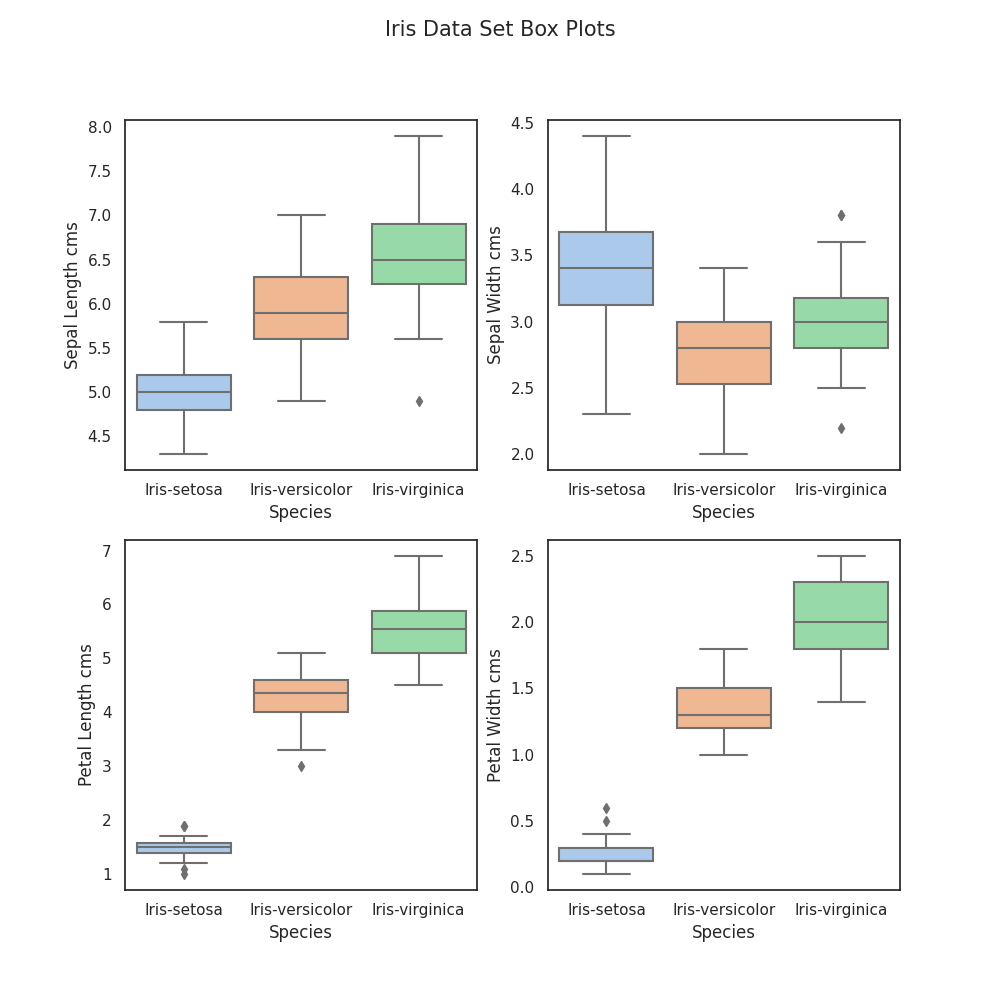
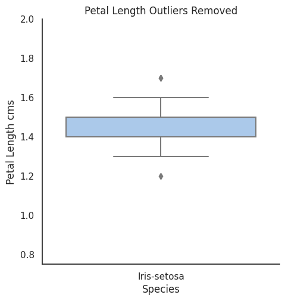
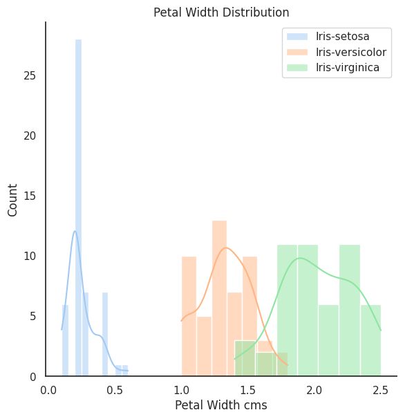
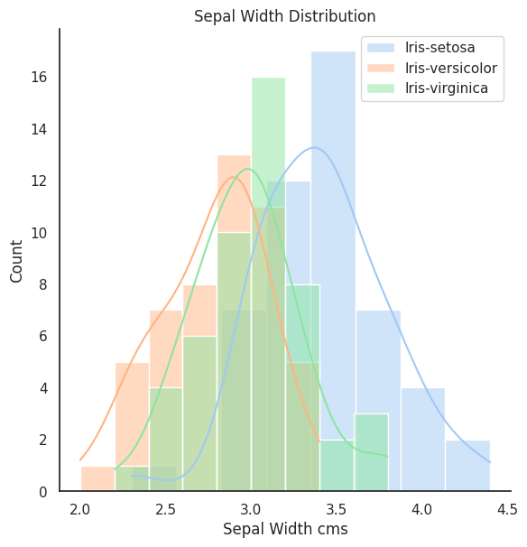

# pands-project

## Contents
[Description](#Description)

[Problem Statement](#Problem-Statement)

[Definitions](#Definitions)

[Background](#Background)

[analysis.py](analysis.py)

[Discussion](#Discussion)

[Problem Statement](#problem-statement)

[Conclusion](#Conclusion)

[References](#References)

[Appendix 1](#Appendix-1)

## Description

This repository contains the files for the submission of the module assignment in the Programming and Scripting module
for the ATU Mayo & Galway Higher Diploma in Computer Programming and Data Analytics.

To run the script from the command line type - *"python analysis.py"*

### Problem Statement
This project concerns the well-known [Fisher’s Iris data set](#Background).

Imagine that your manager has asked you to investigate the data set, with a
view to explaining it to your colleagues. Imagine that you are to give a presentation on the
data set in a few weeks’ time, where you explain what investigating a data set entails and how
Python can be used to do it. 

---
## Definitions

+ [Boxplot](https://en.wikipedia.org/wiki/Box_plot) - is a method for graphically demonstrating the spread of numerical 
data through their quantities 
+ [Histogram](https://en.wikipedia.org/wiki/Histogram) - is a representation of the approximated distribution of 
numerical data.
+ [Multivariate Statistics](https://en.wikipedia.org/wiki/Iris_flower_data_set) - is a branch of statistics that is 
used when two or more variables have to be analysed simultaneously. Types of Multivariate Analysis include 
Cluster Analysis, Factor Analysis, Multiple Regression Analysis, Principal Component Analysis, etc. There is more than
20 ways to perform multivariate analysis.
+ [Sepal](https://en.wikipedia.org/wiki/Sepal) - in plants that flower the sepal is the part of the flower that 
functions as protection for the flower in bud and often as support for the petals when the flower is in bloom.
+ [Violin Plot](https://en.wikipedia.org/wiki/Violin_plot) - a statistical graphic for comparing 
probability distributions

---
## Background

The [Iris Data Set](https://en.wikipedia.org/wiki/Iris_flower_data_set) is a data set that consists 50 samples from 
three species of Iris - Iris-setosa, Iris-virginica and Iris-versicolor. Each sample contains 4 measurements:
1. Petal width
2. Petal length
3. Sepal width
4. Sepal length

This data set is an example of a multivariate data set and was popularised by statistician and biologist [Sir Ronald
Fisher](https://en.wikipedia.org/wiki/Ronald_Fisher) in his 1936 paper entitled 
[*"The use of multiple measurements in taxonomic problems"*](https://digital.library.adelaide.edu.au/dspace/bitstream/2440/15227/1/138.pdf)
. The data was collected by [Dr. Edgar Anderson](https://en.wikipedia.org/wiki/Edgar_Anderson) from the Gaspé Peninsula
in Canada. Two of the three species were collected from the same meadow, by the same person, using standard equipment 
in order to minimise the risk of variation in the data samples arising from the way in which it was collected and 
measured. Dr. Anderson is recognised as a significant contributor in the field of botanical genetics.

As can be seen from the picture below the appearance of each species is similar. Sir Fisher's Analysis of the data set
enabled accurate classification of the species from petal and sepal measurement and as a result the data set is 
routinely used as a beginners dataset for machine learning purposes.

---

## analysis.py

This script is run from the command line with the command *python analysis.py*. There is no output to the command line.
 The script generates a number of tables and graphs, listed [here](#output-files), that are used to analyse the data 
set. 

### The script:
+ Reads in the Iris Data Set CSV from a URL
+ Checks for missing values in the data and outputs the results to a summary table
+ Outputs the Iris Data Set variables to a text file
+ Creates a summary of the data in the tabular form
+ Outputs the full data set in tabular form
+ Creates histograms used to analyse the data set
+ Creates and outputs box plots of the data set
+ Demonstrates an example of removing the outliers and re-plotting a box plot

### Libraries used:

### Output files:
+ [data_summary.txt](images/tables/data_summary.png "Data Summary") - a text file containing a summary of the Iris Day 
set generated by analysis.py
+ [table_plotly.png](images/tables/iris_data_set_full.png "Full Iris Data Set") - a png file with a tabular summary 
of the iris data set - see [Appendix 1](#appendix-1)
+ [petal_length_histogram.png](images/plots/histograms/petal_length_histogram.png "Petal Length Histogram") - 
png file of histogram for petal length
+ [petal_width_histogram.png](images/plots/histograms/petal_width_histogram.png "Petal Width Histogram") - png file of
histogram for petal width
+ [sepal_length_histogram.png](images/plots/histograms/sepal_length_histogram.png "Sepal Length Histogram") - png 
file of histogram for sepal length
+ [sepal_width_histogram.png](images/plots/histograms/sepal_width_histogram.png "Sepal Width Histogram") - png file of
histogram for sepal width
---
## Discussion
Python is an extremely powerful tool for automating the handling of large data sets. Using Python scripting the Iris 
Data Set was automatically read in as a dataframe by a module within Python from an online data repository. The 
Pandas module was used to achieve this. Pandas is a library that can be imported into Python that allows for data 
analysis through the use of specifically designed tools that automate complex functions on data sets. 

All the tables summarising data set were produced using the Plotly & Kaleido modules within python. These tools 
automate the creation of formatted tables. For the full tabulated Iris Data set please see [Appendix 1](#appendix-1).

### Data Quality

The quality of the source data was checked using a number of python methods imported from the Pandas module.
The "isnull" method within Pandas allows the source data set to be checked for any missing values. 
[Table 1](images/tables/missing_values.png) demonstrates the completeness of the data set and the absense of any missing 
values.

**Table 1 - Missing Values**

The Pandas "describe" method crates a summary of the min, max, mean, std, etc. as demonstrated in Table 2. This allows 
for a summary of the distribution of the data within the data set. This method can also be used to validate the count 
of the number of rows in the data set. As can be seen from the table this equals 150, as expected. 

**Table 2 - Data Summary** 

 

Boxplots were used to to identify the presence of outliers in the data set. Outliers are described as objects that 
deviate significantly from the rest for the objects. 
[Outliers](https://medium.com/analytics-vidhya/its-all-about-outliers-cbe172aa1309) can be caused by a number of things 
including measurement error, sampling problems and natural variation. The outliers are visisible on Plot 1 as 
diamonds. Plot 1 demonstrates that the number of outliers is minimal.

**Plot 1 - Iris Data Set Boxplots**

Applying the [interquartile method](https://www.geeksforgeeks.org/detect-and-remove-the-outliers-using-python/) 
it is possible to remove outliers from the data set using python. The challenge with the Iris data set is it's small
size and relatively small number of outliers. For demonstrative purposes one could look at cleansing the Iris-setosa 
petal length outliers. Plot 2 demonstrates the outliers for this subset of the data set. Plot 3 demonstrates the 
boxplot for the subset that has been cleansed of outliers using the interquartile method. Plot seems to indicate that 
further outliers remain. The small dataset size is causing this anomaly. Four outlier data points are removed when 
applying the interquartile method for this sub dataset. Given the anomaly caused by removing outliers, cleansing data 
of outliers only adds value with larger data sets. 

**Plot 2 - Outlier Demonstration**

**Plot 3 - Outlier Cleansed Subset**

### Univariate Analysis
The Seaborn library was used to create [histograms](#definitions). [Seaborn](https://seaborn.pydata.org/index.html) is 
a Python data visualization library based on matplotlib. It allows for drawing attractive and informative statistical
graphics.

**Plot 4 - Petal Length Distribution Histogram**

Plot 4 demonstrates that Iris-setosa has the smallest petal length falling roughly between 1-2cms. There is some 
overlap in Petal Length between Iris-versicolor and Iris-virginica. 

**Plot 5 - Petal Width Distribution Histogram**

Plot 5 demonstrates that Iris-setosa has the smallest petal width. There is some overlap in the petal width upper 
values of Iris-versicolor and the lower values of Iris-virginica. 

**Plot 6 - Sepal Length Distribution Histogram**

Plot 6 & 7 demonstrate that there is overlap in the range of values for sepal length & sepal width for all species 
measured. Based on this observation sepal width and sepal length are less accurate identifiers of species than petal 
length and width.

**Plot 7 - Sepal Width Distribution Histogram**

Violin plots  (see plot 8) are similar to boxplots. In simple terms denser regions of data are fatter while less dense regions are 
thinner. The output of this analysis supports the view that there is clear separation in petal length and petal width
for Iris-setosa, making these variables good identifiers of the Iris-setosa species. It also confirms that there is 
overlap between sepal length and sepal width making them less ideal candidate for blind classification of the species.

**Plot 8 - Iris Data Set Violin PLots**

## Conclusion

## References

### Code Sources

1. https://www.geeksforgeeks.org/detect-and-remove-the-outliers-using-python/ - accessed- 10/04/2023
2. https://gist.github.com/curran/a08a1080b88344b0c8a7#file-iris-csv - accessed 30/03/2023
3. https://gist.github.com/mwaskom/de44147ed2974457ad6372750bbe5751 - accessed 30/03/2023
4. https://seaborn.pydata.org/generated/seaborn.set_theme.html - accessed 30/03/2023
5. https://www.shanelynn.ie/pandas-drop-delete-dataframe-rows-columns/ - accessed 10/04/2023
6. https://www.delftstack.com/howto/python-pandas/pandas-png/ - accessed 30/03/2023
7. https://www.geeksforgeeks.org/exploratory-data-analysis-on-iris-dataset/ - accessed 03/04/2023
8. https://www.marsja.se/how-to-save-a-seaborn-plot-as-a-file-e-g-png-pdf-eps-tiff/ - accessed 30/03/2023
9. https://www.statology.org/pandas-to-text-file/ - accessed 30/03/2023

### Background Information
1. https://digital.library.adelaide.edu.au/dspace/bitstream/2440/15227/1/138.pdf - accessed 27/03/2023
2. https://en.wikipedia.org/wiki/Box_plot - accessed 10/04/2023
3. https://en.wikipedia.org/wiki/Edgar_Anderson - accessed 27/03/2023
4. https://en.wikipedia.org/wiki/Iris_flower_data_set - accessed 27/03/2023
5. https://en.wikipedia.org/wiki/Histogram - accessed 06/04/2023
6. https://en.wikipedia.org/wiki/Ronald_Fisher - accessed 27/03/2023
7. https://en.wikipedia.org/wiki/Sepal - accessed 27/03/2023
8. https://en.wikipedia.org/wiki/Violin_plot - accessed 10/04/2023
8. (https://medium.com/analytics-vidhya/its-all-about-outliers-cbe172aa1309) - accessed 10/04/2023
9. https://seaborn.pydata.org/index.html - accessed 06/04/2023
10. https://www.kaggle.com/code/amrut11/iris-dataset-univariate-bivariate-multivariate - accessed 27/03/2023

---

## Appendix 1

**Table  - Iris Data Set** 

